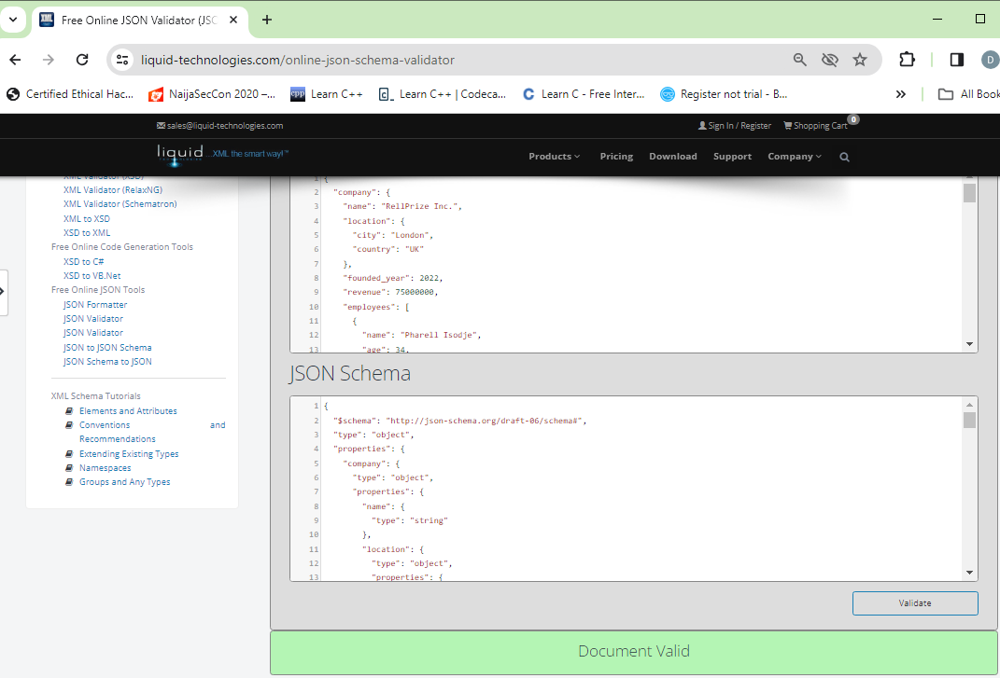
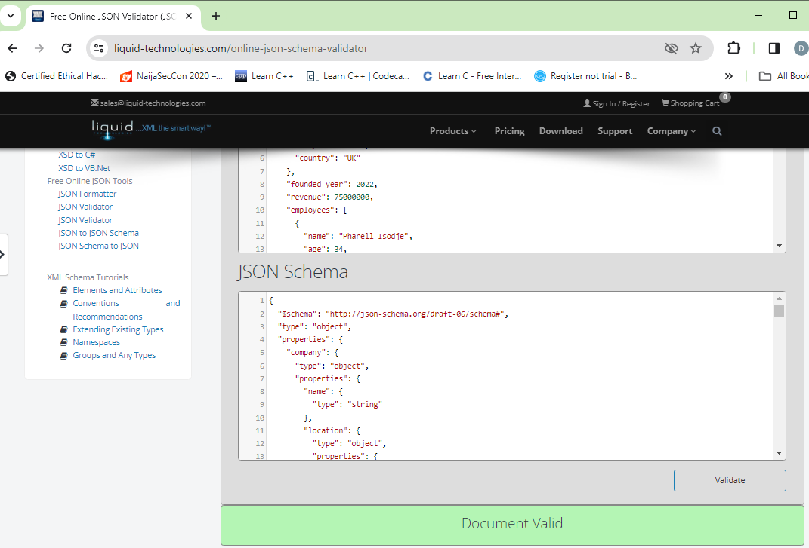

# JSON

## Task: 

To create a large JSON document with data and a corresponding JSON schema. The JSON document is to contain various data type elements, demonstrates appropriate complexity, and it is valid against the corresponding JSON schema.

## Solution:

Note: If the screenshots in this section are not showing, you can get the PDF [here.](https://drive.google.com/file/d/1u3Xyszm420XzZXfVnOf0Xe2Fuvow9INQ/view?usp=sharing)

### JSON DOCUMENT:

The JSON Document contains different data types such as integer, float, date, strings, and lists.

```
{
  "company": {
    "name": "RellPrize Inc.",
    "location": {
      "city": "London",
      "country": "UK"
    },
    "founded_year": 2022,
    "revenue": 75000000,
    "employees": [
      {
        "name": "Pharell Isodje",
        "age": 34,
        "position": "CEO",
        "salary": 200000,
        "departments": ["Management", "Finance"]
      },
      {
        "name": "Donatus Enebuse",
        "age": 35,
        "position": "CTO",
        "salary": 180000,
        "departments": ["Engineering", "Technology"]
      },
      {
        "name": "Dorcas Isodje",
        "age": 28,
        "position": "CFO",
        "salary": 190000,
        "departments": ["Finance"]
      }
    ]
  },
  "products": [
    {
      "name": "AlgoMA",
      "price": 499.99,
      "available": true,
      "description": "Our flagship product, packed with cutting-edge technology.",
      "tags": ["service", "finance", "trading"],
      "launch_date": "2023-05-15"
    },
    {
      "name": "TradeMA",
      "price": 299.99,
      "available": false,
      "description": "A versatile app designed to streamline your trading.",
      "tags": ["app", "efficiency", "productivity"],
      "launch_date": "2024-01-05"
    }
  ],
  "partners": {
    "businesses": [
      {
        "name": "TradeAI Solutions",
        "location": {
          "city": "New York",
          "country": "USA"
        },
        "revenue": 120000000,
        "industry": "Finance Technologies"
      },
      {
        "name": "InnovateUI Ltd.",
        "location": {
          "city": "London",
          "country": "UK"
        },
        "revenue": 85000000,
        "industry": "Software Development"
      }
    ],
    "consultants": [
      {
        "name": "TechConsult Inc.",
        "specialization": "IT Strategy",
        "rate_per_hour": 150
      },
      {
        "name": "Analytica LLC",
        "specialization": "Data Science",
        "rate_per_hour": 200
      }
    ]
  },
  "events": [
    {
      "name": "Market Insider 2024",
      "location": "San Francisco",
      "date": "2024-08-10",
      "attendees": 5000,
      "speakers": ["Elon Musk", "Warren Buffet", "George Soros"]
    },
    {
      "name": "TradeCon",
      "location": "Seattle",
      "date": "2024-11-05",
      "attendees": 3000,
      "speakers": ["TraderJi", "D3D8", "Traderathome", "SonicDeeJay", "CobraFX"]
    }
  ]
}
```

### JSON Schema:

```
{
  "$schema": "http://json-schema.org/draft-06/schema#",
  "type": "object",
  "properties": {
    "company": {
      "type": "object",
      "properties": {
        "name": {
          "type": "string"
        },
        "location": {
          "type": "object",
          "properties": {
            "city": {
              "type": "string"
            },
            "country": {
              "type": "string"
            }
          },
          "required": [
            "city",
            "country"
          ]
        },
        "founded_year": {
          "type": "integer"
        },
        "revenue": {
          "type": "integer"
        },
        "employees": {
          "type": "array",
          "items": [
            {
              "type": "object",
              "properties": {
                "name": {
                  "type": "string"
                },
                "age": {
                  "type": "integer"
                },
                "position": {
                  "type": "string"
                },
                "salary": {
                  "type": "integer"
                },
                "departments": {
                  "type": "array",
                  "items": [
                    {
                      "type": "string"
                    },
                    {
                      "type": "string"
                    }
                  ]
                }
              },
              "required": [
                "name",
                "age",
                "position",
                "salary",
                "departments"
              ]
            },
            {
              "type": "object",
              "properties": {
                "name": {
                  "type": "string"
                },
                "age": {
                  "type": "integer"
                },
                "position": {
                  "type": "string"
                },
                "salary": {
                  "type": "integer"
                },
                "departments": {
                  "type": "array",
                  "items": [
                    {
                      "type": "string"
                    },
                    {
                      "type": "string"
                    }
                  ]
                }
              },
              "required": [
                "name",
                "age",
                "position",
                "salary",
                "departments"
              ]
            },
            {
              "type": "object",
              "properties": {
                "name": {
                  "type": "string"
                },
                "age": {
                  "type": "integer"
                },
                "position": {
                  "type": "string"
                },
                "salary": {
                  "type": "integer"
                },
                "departments": {
                  "type": "array",
                  "items": [
                    {
                      "type": "string"
                    }
                  ]
                }
              },
              "required": [
                "name",
                "age",
                "position",
                "salary",
                "departments"
              ]
            }
          ]
        }
      },
      "required": [
        "name",
        "location",
        "founded_year",
        "revenue",
        "employees"
      ]
    },
    "products": {
      "type": "array",
      "items": [
        {
          "type": "object",
          "properties": {
            "name": {
              "type": "string"
            },
            "price": {
              "type": "number"
            },
            "available": {
              "type": "boolean"
            },
            "description": {
              "type": "string"
            },
            "tags": {
              "type": "array",
              "items": [
                {
                  "type": "string"
                },
                {
                  "type": "string"
                },
                {
                  "type": "string"
                }
              ]
            },
            "launch_date": {
              "type": "string"
            }
          },
          "required": [
            "name",
            "price",
            "available",
            "description",
            "tags",
            "launch_date"
          ]
        },
        {
          "type": "object",
          "properties": {
            "name": {
              "type": "string"
            },
            "price": {
              "type": "number"
            },
            "available": {
              "type": "boolean"
            },
            "description": {
              "type": "string"
            },
            "tags": {
              "type": "array",
              "items": [
                {
                  "type": "string"
                },
                {
                  "type": "string"
                },
                {
                  "type": "string"
                }
              ]
            },
            "launch_date": {
              "type": "string"
            }
          },
          "required": [
            "name",
            "price",
            "available",
            "description",
            "tags",
            "launch_date"
          ]
        }
      ]
    },
    "partners": {
      "type": "object",
      "properties": {
        "businesses": {
          "type": "array",
          "items": [
            {
              "type": "object",
              "properties": {
                "name": {
                  "type": "string"
                },
                "location": {
                  "type": "object",
                  "properties": {
                    "city": {
                      "type": "string"
                    },
                    "country": {
                      "type": "string"
                    }
                  },
                  "required": [
                    "city",
                    "country"
                  ]
                },
                "revenue": {
                  "type": "integer"
                },
                "industry": {
                  "type": "string"
                }
              },
              "required": [
                "name",
                "location",
                "revenue",
                "industry"
              ]
            },
            {
              "type": "object",
              "properties": {
                "name": {
                  "type": "string"
                },
                "location": {
                  "type": "object",
                  "properties": {
                    "city": {
                      "type": "string"
                    },
                    "country": {
                      "type": "string"
                    }
                  },
                  "required": [
                    "city",
                    "country"
                  ]
                },
                "revenue": {
                  "type": "integer"
                },
                "industry": {
                  "type": "string"
                }
              },
              "required": [
                "name",
                "location",
                "revenue",
                "industry"
              ]
            }
          ]
        },
        "consultants": {
          "type": "array",
          "items": [
            {
              "type": "object",
              "properties": {
                "name": {
                  "type": "string"
                },
                "specialization": {
                  "type": "string"
                },
                "rate_per_hour": {
                  "type": "integer"
                }
              },
              "required": [
                "name",
                "specialization",
                "rate_per_hour"
              ]
            },
            {
              "type": "object",
              "properties": {
                "name": {
                  "type": "string"
                },
                "specialization": {
                  "type": "string"
                },
                "rate_per_hour": {
                  "type": "integer"
                }
              },
              "required": [
                "name",
                "specialization",
                "rate_per_hour"
              ]
            }
          ]
        }
      },
      "required": [
        "businesses",
        "consultants"
      ]
    },
    "events": {
      "type": "array",
      "items": [
        {
          "type": "object",
          "properties": {
            "name": {
              "type": "string"
            },
            "location": {
              "type": "string"
            },
            "date": {
              "type": "string"
            },
            "attendees": {
              "type": "integer"
            },
            "speakers": {
              "type": "array",
              "items": [
                {
                  "type": "string"
                },
                {
                  "type": "string"
                },
                {
                  "type": "string"
                }
              ]
            }
          },
          "required": [
            "name",
            "location",
            "date",
            "attendees",
            "speakers"
          ]
        },
        {
          "type": "object",
          "properties": {
            "name": {
              "type": "string"
            },
            "location": {
              "type": "string"
            },
            "date": {
              "type": "string"
            },
            "attendees": {
              "type": "integer"
            },
            "speakers": {
              "type": "array",
              "items": [
                {
                  "type": "string"
                },
                {
                  "type": "string"
                },
                {
                  "type": "string"
                },
                {
                  "type": "string"
                },
                {
                  "type": "string"
                }
              ]
            }
          },
          "required": [
            "name",
            "location",
            "date",
            "attendees",
            "speakers"
          ]
        }
      ]
    }
  },
  "required": [
    "company",
    "products",
    "partners",
    "events"
  ]
}
```

### Validating the JSON document against the JSON Schema:

Screenshots showing successful validation of the JSON Document against the JSON Schema using: https://www.liquid-technologies.com/online-json-schema-validator/ 




